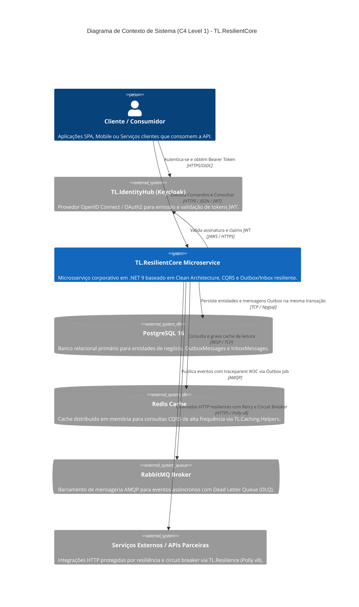
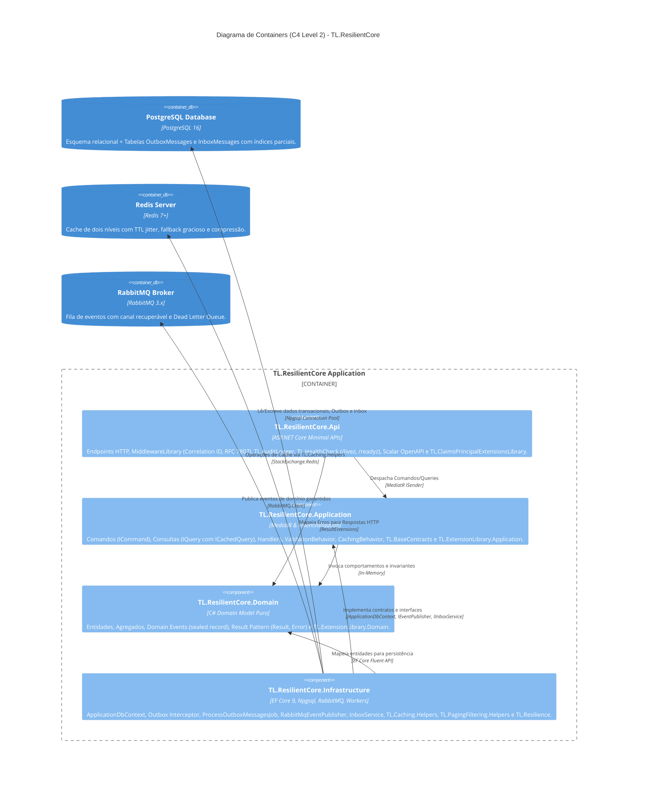
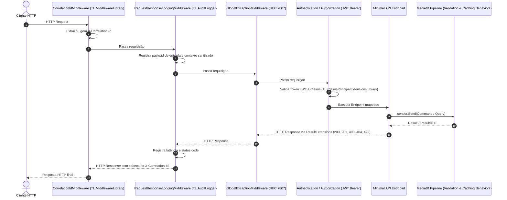
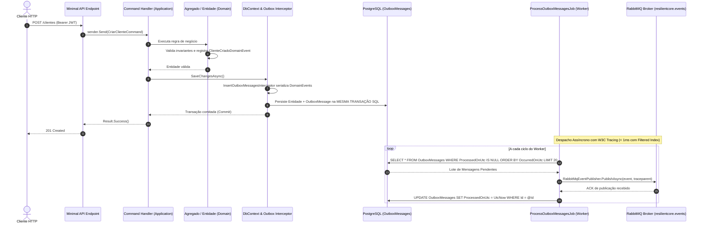

# 🏛️ Visão Geral da Arquitetura — TL.ResilientCore

O **TL.ResilientCore** é um Enterprise Microservice Starter Kit e Template para .NET 9 projetado sob os princípios de **Clean Architecture**, **Domain-Driven Design (DDD)**, **Command Query Responsibility Segregation (CQRS)**, **Design for Failure** e **Reutilização de Bibliotecas do Ecossistema TL**.

O template é voltado para sistemas corporativos de alta criticidade, integridade transacional estrita e arquiteturas orientadas a eventos, mitigando falhas silenciosas, inconsistência eventual por *dual write* e gargalos de I/O.

---

## 🎯 1. Diagrama C4 — Nível 1: Contexto do Sistema (System Context)

O diagrama abaixo ilustra as fronteiras do sistema gerado pelo `TL.ResilientCore`, seus consumidores, componentes de infraestrutura e serviços externos:

---

## 📦 2. Diagrama C4 — Nível 2: Containers & Componentes (Containers & Architecture)

A organização interna do `TL.ResilientCore` segue o isolamento de dependências da **Clean Architecture**, onde o Domínio é agnóstico a tecnologias externas e a Infraestrutura e Apresentação implementam os adaptadores concretos:

---

## 🌐 3. Pipeline HTTP de Apresentação e Middlewares

O pipeline de requisições na camada `Presentation.Api` segue uma ordem determinística de execução, garantindo correlação, telemetria e tratamento padronizado de erros:

---

## 🔄 4. Garantia Transacional: Outbox Pattern & Transactional Inbox

O `TL.ResilientCore` assegura consistência eventual confiável entre serviços através da combinação dos padrões **Transactional Outbox** e **Transactional Inbox**.

### 4.1. Despacho Confiável (Transactional Outbox)
Garante entrega *At-Least-Once* sem risco de inconsistência por *Dual Write*:

### 4.2. Consumo Idempotente (Transactional Inbox)
Garante que eventos reentregues pelo broker não provoquem efeitos colaterais duplicados:
* Implementado via `IInboxService` e tabela `inbox_messages`.
* Antes do processamento de um evento, o serviço registra o identificador único do evento (`EventId`).
* Caso a mensagem já tenha sido processada ou esteja em processamento concorrente, a operação é ignorada de forma idempotente.

---

## 🧱 5. Detalhamento das Camadas e Bibliotecas Integradas

### 5.1. Camada de Domínio (`TL.ResilientCore.Domain`)
* **Isolamento Estrito**: Depende exclusivamente do runtime .NET 9 e da biblioteca utilitária `TL.ExtensionLibrary.Domain`. Sem referências a EF Core, ASP.NET Core ou infraestrutura externa.
* **Encapsulamento de Estado**: Construtores públicos são desabilitados em entidades e agregados (garantido por testes de arquitetura). Modificações de estado ocorrem apenas por métodos expressivos de domínio que protegem invariantes.
* **Domain Events Imutáveis**: Definidos como `sealed record` herdando de `IDomainEvent`, com metadados de rastreabilidade (`EventId`, `OccurredOnUtc`).
* **Result Pattern (`Result`, `Result<T>`, `Error`)**: Todas as operações de negócio utilizam retornos explícitos de sucesso ou falha, evitando o uso de exceções como controle de fluxo (vide [ADR-002](../adr/002-result-pattern.md)).

### 5.2. Camada de Aplicação (`TL.ResilientCore.Application`)
* **CQRS com MediatR**: Segregação de comandos de escrita (`ICommand<T>`) e consultas de leitura (`IQuery<T>`).
* **ValidationBehavior**: Intercepta comandos antes do handler, executa regras do `FluentValidation` e retorna falhas estruturadas (`Error.Validation`) sem lançar exceções.
* **CachingBehavior (FinOps Caching)**: Consultas anotadas com `ICachedQuery<T>` são interceptadas automaticamente, consultando o Redis antes de atingir o banco de dados. Conta com TTL jitter, fallback transparente em caso de indisponibilidade do cache e compressão (vide [ADR-007](../adr/007-finops-caching-cqrs.md)).
* **Contratos Base**: Utiliza `TL.BaseContracts` para interfaces fundamentais de repositório e aplicação.

### 5.3. Camada de Infraestrutura (`TL.ResilientCore.Infrastructure`)
* **Entity Framework Core 9**: Mapeamento relacional com PostgreSQL via `Npgsql.EntityFrameworkCore.PostgreSQL`.
* **Outbox com Índice Parcial**:
  * Configuração: `builder.HasIndex(x => x.OccurredOnUtc).HasFilter("\"ProcessedOnUtc\" IS NULL");`
  * O índice cobre apenas mensagens não processadas, mantendo o custo de varredura constante mesmo com alto volume histórico (vide [ADR-001](../adr/001-indices-filtrados-outbox.md)).
* **Mensageria RabbitMQ & W3C Tracing**: Despacho via `RabbitMqEventPublisher` (`TL.RabbitMQ`) com topologia de Dead Letter Queue (`resilientcore.events.dlq`), reconexão resiliente e injeção de cabeçalhos de contexto distribuído `traceparent` via `ActivitySource` (vide [ADR-008](../adr/008-inbox-pattern-e-observabilidade-cloud-native.md)).
* **Paginação e Filtros Dinâmicos**: Integração de `TL.PagingFiltering.Helpers` para paginação determinística (keyset seek e offset) e composição booleana com Specification Pattern (vide [ADR-005](../adr/005-integracao-bibliotecas-reutilizaveis-ecossistema.md)).
* **Resiliência HTTP**: Políticas do Polly v8 configuradas via `TL.Resilience` para comunicação resiliente com serviços externos.

### 5.4. Camada de Apresentação (`TL.ResilientCore.Api`)
* **Minimal APIs**: Endpoints estáticos organizados por grupos de rotas com mapeamento de tipos de resultado.
* **Middlewares de Governança**: `TL.MiddlewareLibrary` fornecendo rastreabilidade por Correlation ID e padronização RFC 7807 (ProblemDetails).
* **Auditoria de Requisições**: `TL.AuditLogger` para logging estruturado com proteção de dados sensíveis.
* **Health Checks Cloud-Native**: Integração de `TL.HealthCheck` expondo probes `/livez` (liveness do processo) e `/readyz` (readiness de banco e mensageria).
* **Documentação Interativa**: Suporte a OpenAPI e documentação via Scalar (`Scalar.AspNetCore`) em `/scalar/v1`.
* **Autenticação JWT**: Suporte nativo a tokens Bearer com extração de claims via `TL.ClaimsPrincipalExtensionsLibrary`.
* **Container Chiseled**: Empacotamento em imagem distroless (`mcr.microsoft.com/dotnet/nightly/aspnet:9.0-chiseled-extra`), sem shell e com menor superfície de ataque.

---

## 🔺 6. Estratégia de Testes Automatizados

O template inclui três níveis de testes automatizados com cobertura das principais garantias arquiteturais:

| Projeto | Tecnologia | Escopo de Validação |
| :--- | :--- | :--- |
| **`TL.ResilientCore.ArchitectureTests`** | NetArchTest.Rules + xUnit | Regras de arquitetura limpa: isolamento do Domínio, imutabilidade de Domain Events, convenções CQRS e proteção de construtores de agregados. |
| **`TL.ResilientCore.UnitTests`** | xUnit + FluentAssertions | Regras isoladas de negócio, Result Pattern, comportamentos de pipeline (ValidationBehavior, CachingBehavior) e InboxService. |
| **`TL.ResilientCore.IntegrationTests`** | Testcontainers + WebApplicationFactory | Testes com instâncias reais de PostgreSQL em container Docker efêmero, validando migrations, endpoints HTTP e persistência do Outbox. |

---

## 🛡️ 7. Decisões Arquiteturais Registradas (ADRs)

Todas as decisões técnicas do starter kit estão formalizadas em Architectural Decision Records:

1. [ADR-000: Arquitetura Base e Convenções Herdadas](../adr/000-arquitetura-e-convencoes-herdados.md)
2. [ADR-001: Uso de Índices Filtrados na Tabela Outbox](../adr/001-indices-filtrados-outbox.md)
3. [ADR-002: Adoção do Result Pattern em Detrimento de Exceptions](../adr/002-result-pattern.md)
4. [ADR-003: Separação de Command e Query (CQRS)](../adr/003-cqrs-adoption.md)
5. [ADR-004: Restrições Arquiteturais, Idempotência e Design for Failure](../adr/004-design-for-failure.md)
6. [ADR-005: Integração de Bibliotecas Reutilizáveis do Ecossistema TL](../adr/005-integracao-bibliotecas-reutilizaveis-ecossistema.md)
7. [ADR-006: Testes de Carga Desacoplados com k6 e Docker](../adr/006-testes-de-carga-desacoplados-k6-docker.md)
8. [ADR-007: FinOps Caching em Consultas CQRS com Fallback Resiliente](../adr/007-finops-caching-cqrs.md)
9. [ADR-008: Transactional Inbox Pattern e Observabilidade Cloud-Native](../adr/008-inbox-pattern-e-observabilidade-cloud-native.md)
